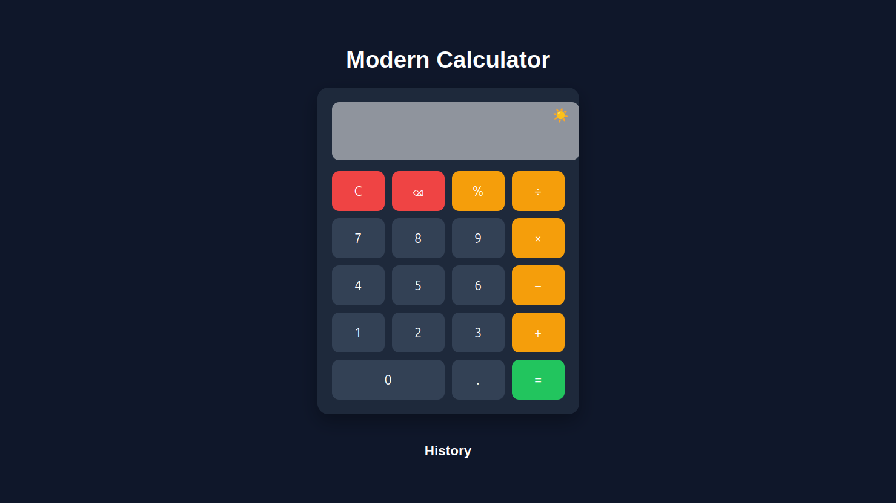

# Modern Calculator

A modern web-based calculator built using HTML, CSS, and JavaScript.

## Features

- Keyboard support
- Dark / Light mode toggle
- Calculation history
- Backspace (erase) button
- Clean modern UI

## Technologies Used

- HTML5
- CSS3
- JavaScript

## How to Use

1. Open the calculator in your browser.
2. Use mouse or keyboard to enter numbers.
3. Press **Enter** to calculate.
4. Press **Backspace** to erase.
5. Press **Escape** to clear.

## Project Structure

modern-calculator
│
├── index.html
├── style.css
├── script.js
└── README.md

## Future Improvements

- Scientific calculator functions
- Save history using localStorage
- Mobile responsive UI

## Author

Md Faizanul Haque  
BCA Student – Integral University

## Screenshot

